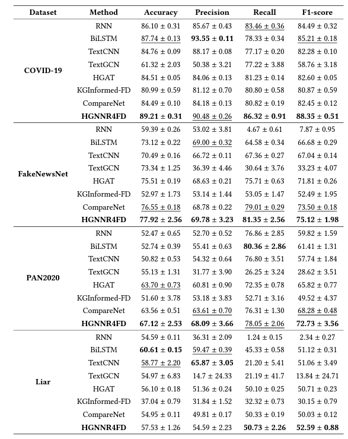

# Heterogeneous Graph Neural Network via Knowledge Relations for Fake News Detection
Open-sourced implementation for Heterogeneous Graph Neural Network via Knowledge Relations for Fake News Detection - HGNNR4FD.

## Python Dependencies
Our proposed HGNNR4FD framework is implemented in Python 3.7 and major libraries include:

Pytorch = 1.11.0+cu102
[PyG] (https://pytorch-geometric.readthedocs.io/en/latest/) torch-geometric=2.1.0
More dependencies are provided in requirements.txt.

## To Run
python src/main.py

## Experimental Results:
We conduct extensive experiments to demonstrate the effectiveness of our method, shown as follows:

